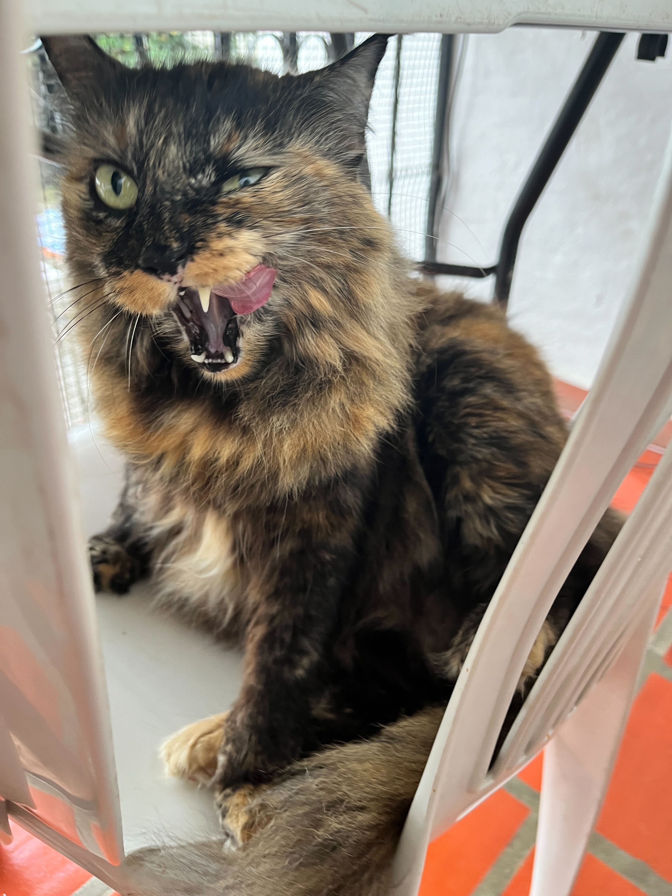
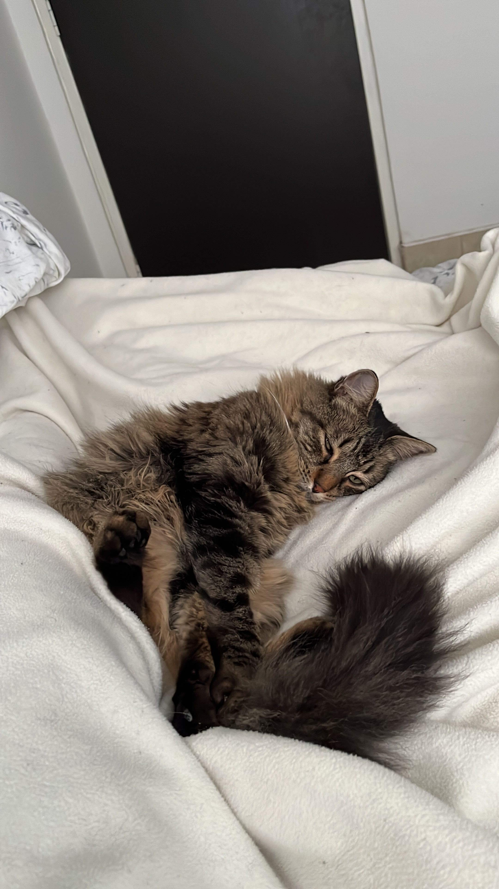

> **Welcome to my blog!** I’m **Wilmar Sepúlveda Herrera**, a statistician with experience in R, Python, Git, Docker, and AWS. As an enthusiastic learner, I am passionate about MLOps, data engineering, and research. I’m from [Jamundí - Valle](https://es.wikipedia.org/wiki/Jamund%C3%AD) and currently live in [Manizales - Caldas](https://es.wikipedia.org/wiki/Manizales) with my wonderful girlfriend [Mayra](https://www.linkedin.com/in/mayra-alejandra-mej%C3%ADa-mart%C3%ADnez-3abb81178/). I started studying Statistics in 2011 at the **Universidad del Valle** and received my undergraduate degree in 2017. In 2020, I began my master’s degree in Statistics, which I completed in 2023. I have worked in various companies, including Universidad del Valle, Banco de Occidente, and Excelcredit, as a Data Scientist. Currently, I am the principal Data Scientist at [R5](https://www.grupor5.com), where I lead a team and develop various machine learning algorithms for the insurance sector.

 

## My pets

  
*Zeus, 4 años*

  
*Lizzie, 11 años*
