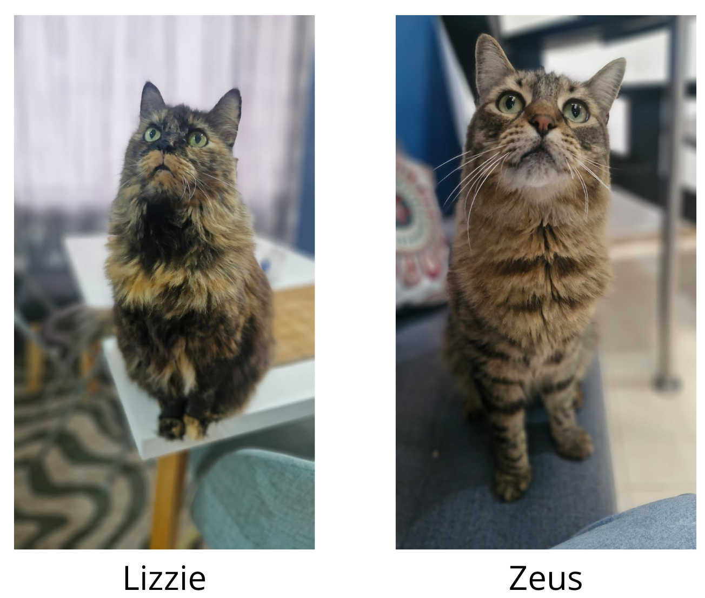

  
  

  

  
  

    
## 👋 Hola, soy Wilmar Sepúlveda Herrera

**Lead Data Scientist** especializado en MLOps, Machine Learning e Inteligencia Artificial para los sectores financiero y asegurador.

Estadístico MSc con **más de 6 años de experiencia** desarrollando soluciones analíticas end-to-end. Apasionado por convertir datos en decisiones estratégicas que generan valor real en los negocios.

Actualmente trabajo para **ASSA** (la empresa de seguros más grande de Centroamérica) en colaboración con **McKinsey & Company**, creando Feature Stores y sistemas de precios dinámicos.

  

## 💼 Experiencia Profesional

### 🚀 Lead Data Scientist — Coderland
**Marzo 2025 – Presente** | Tecnología

Consultoría para **ASSA**, la aseguradora más grande de Centroamérica:

- 💰 Rediseño completo del **modelo de pricing** en seguros de Auto combinando ML y optimización, estimando un incremento anual de **300K USD** en revenue
- 📊 Mejora del proceso de **cobros** en ramos de Auto, Salud y Vida mediante ML y análisis estadístico, incrementando significativamente la recaudación
- 🏗️ Construcción desde cero de la **arquitectura de datos** con pipelines ETL en arquitectura medallón sobre **Databricks**
- 🔍 Solución de **web scraping** para benchmark de precios en el mercado, apoyando decisiones de pricing competitivo
- 📈 Modelos de **predicción de churn** en ramo de vida con análisis de supervivencia y estimación de **LTV**

### 📊 Líder de Analítica Avanzada — R5
**Marzo 2022 – Marzo 2025** | Insurtech

Liderazgo de equipo y resultados de negocio:

- 👥 Lideré un equipo de **5 científicos de datos** en proyectos de ML, Analítica y MLOps
- 🎯 **Loss Ratio de 70% vs 120%** del mercado en SOAT, generando **miles de millones** en ganancias
- 🤖 Aprendizaje no supervisado para mejorar **eficiencia en cobranzas** y selección de clientes

### 💳 Senior Data Scientist — Excelcredit
**Mayo 2021 – Marzo 2022** | Fintech

Soluciones de riesgo crediticio:

- 📉 Modelos de **provisión** y predicción de **prepago**
- 🎭 **Segmentación de clientes** con clustering
- 🛡️ Sistemas de evaluación de **riesgo LAFT**
- 📊 Dashboards automatizados para monitoreo de cartera

### 🏦 Data Scientist — Banco de Occidente
**Sept 2020 – Mayo 2021** | Banca Tradicional

Optimización de procesos bancarios:

- 💰 Modelos de ML para **optimización de cobranza**
- 😷 Modelos predictivos para evaluar impacto de **Covid-19** en flujo de caja
- 📊 Scoring crediticio y normalización de cartera

## 🎓 Educación

  
  

    
### 🎓 Magister en Estadística
**Universidad del Valle**  
2020 – 2023 | **GPA: 4.7/5.0**

Especialización en modelado estadístico avanzado, análisis de supervivencia y métodos predictivos.

  

  

    
### 📊 Estadístico
**Universidad del Valle**  
2011 – 2017 | **GPA: 4.0/5.0**

Fundamentos sólidos en teoría de probabilidad, inferencia estadística y análisis de datos.

  

## 👨‍🏫 Experiencia Docente

### 📚 Docente — Universidad Libre, Cali
**Nov 2023 – Presente** | Diplomado Machine Learning

- Imparto **Estadística para Ciencia de Datos** a 4 cohortes
- Currículo sobre probabilidad, pruebas de hipótesis, regresión e inferencia
- Proyectos prácticos con **Python y R**

**También he enseñado en:**
- 🎓 **Universidad del Valle** — Probabilidad y Estadística (Ing. Sistemas y Agrícola)
- 📖 **Comfenalco PEC** — Matemáticas y procesamiento de datos

## 🛠️ Stack Tecnológico

  Python
  R
  Docker
  Git
  PostgreSQL
  Airflow
  AWS
  FastAPI
  Databricks
  DVC
  Jenkins
  Linux
  Kedro

## 🚀 Proyectos Destacados

<a href="https://github.com/Wilmar3752/pdist" target="_blank" class="group rounded-xl p-4 bg-slate-200/50 dark:bg-slate-800/50 border border-slate-300 dark:border-slate-700 hover:border-primary-500 transition-all duration-300 hover:shadow-lg">
  <h4 class="font-bold text-lg mb-2 group-hover:text-primary-600 dark:group-hover:text-primary-400">📦 pdist</h4>
  
Paquete Python para identificar automáticamente la mejor distribución de probabilidad. Implementa pruebas KS, Anderson-Darling y Chi-cuadrado, criterios AIC/BIC y visualizaciones.

</a>

<a href="https://github.com/Wilmar3752/itseries" target="_blank" class="group rounded-xl p-4 bg-slate-200/50 dark:bg-slate-800/50 border border-slate-300 dark:border-slate-700 hover:border-accent-500 transition-all duration-300 hover:shadow-lg">
  <h4 class="font-bold text-lg mb-2 group-hover:text-accent-600 dark:group-hover:text-accent-400">📊 itseries</h4>
  
Paquete R para analizar procesos estocásticos con espaciado irregular — desarrollado durante la investigación de maestría en Estadística.

</a>

<a href="https://github.com/Wilmar3752/car_predict" target="_blank" class="group rounded-xl p-4 bg-slate-200/50 dark:bg-slate-800/50 border border-slate-300 dark:border-slate-700 hover:border-secondary-500 transition-all duration-300 hover:shadow-lg">
  <h4 class="font-bold text-lg mb-2 group-hover:text-secondary-600 dark:group-hover:text-secondary-400">🤖 car_predict</h4>
  
Pipeline ML end-to-end para predicción de precios de autos con versionado de modelos, API REST y despliegue contenerizado.

</a>

<a href="https://github.com/Wilmar3752/ETL_scraper" target="_blank" class="group rounded-xl p-4 bg-slate-200/50 dark:bg-slate-800/50 border border-slate-300 dark:border-slate-700 hover:border-primary-500 transition-all duration-300 hover:shadow-lg">
  <h4 class="font-bold text-lg mb-2 group-hover:text-primary-600 dark:group-hover:text-primary-400">🚗 ETL_scraper</h4>
  
Pipeline ETL automatizado que extrae datos de vehículos, los procesa con Python y los carga a AWS S3 vía CI/CD.

</a>

<a href="https://github.com/Wilmar3752/cluster-app" target="_blank" class="group rounded-xl p-4 bg-slate-200/50 dark:bg-slate-800/50 border border-slate-300 dark:border-slate-700 hover:border-accent-500 transition-all duration-300 hover:shadow-lg">
  <h4 class="font-bold text-lg mb-2 group-hover:text-accent-600 dark:group-hover:text-accent-400">🧩 cluster-app</h4>
  
App web interactiva para segmentación de clientes de tarjetas de crédito con aprendizaje no supervisado, desplegada en HuggingFace Spaces.

</a>

<a href="https://github.com/Wilmar3752/meli_scrapper" target="_blank" class="group rounded-xl p-4 bg-slate-200/50 dark:bg-slate-800/50 border border-slate-300 dark:border-slate-700 hover:border-secondary-500 transition-all duration-300 hover:shadow-lg">
  <h4 class="font-bold text-lg mb-2 group-hover:text-secondary-600 dark:group-hover:text-secondary-400">🛒 meli_scrapper</h4>
  
Web scraper de todos los productos publicados en Mercado Libre, contenerizado y desplegado con CI/CD.

</a>

<a href="https://github.com/Wilmar3752/pptex" target="_blank" class="group rounded-xl p-4 bg-slate-200/50 dark:bg-slate-800/50 border border-slate-300 dark:border-slate-700 hover:border-primary-500 transition-all duration-300 hover:shadow-lg">
  <h4 class="font-bold text-lg mb-2 group-hover:text-primary-600 dark:group-hover:text-primary-400">📄 pptex</h4>
  
Toolkit basado en Docker para generar presentaciones y reportes LaTeX en cualquier OS — sin necesidad de instalar LaTeX. Soporta pdflatex, xelatex, lualatex y modo watch.

</a>

## 📫 Conectemos

¿Interesado en **MLOps**, **Machine Learning** en seguros o finanzas, o simplemente quieres charlar sobre **Data Science**?

  <a href="https://www.linkedin.com/in/wilmar3752/" target="_blank" class="inline-flex items-center gap-2 px-4 py-2 bg-gradient-to-r from-primary-600 to-accent-500 text-white rounded-lg hover:scale-105 transition-transform duration-300 shadow-md">
    💼 LinkedIn
  </a>
  <a href="https://github.com/wilmar3752" target="_blank" class="inline-flex items-center gap-2 px-4 py-2 bg-gradient-to-r from-secondary-600 to-primary-600 text-white rounded-lg hover:scale-105 transition-transform duration-300 shadow-md">
    💻 GitHub
  </a>
  <a href="mailto:wilmar.sepulveda2@gmail.com" class="inline-flex items-center gap-2 px-4 py-2 bg-gradient-to-r from-accent-500 to-primary-500 text-white rounded-lg hover:scale-105 transition-transform duration-300 shadow-md">
    📧 Email
  </a>

## 🐾 Vida Personal

  

  
Vivo en **Manizales, Caldas** 🇨🇴 con mi maravillosa novia [Mayra](https://www.linkedin.com/in/mayra-alejandra-mej%C3%ADa-mart%C3%ADnez-3abb81178/) y nuestras mascotas 🐾

Originario de **Jamundí, Valle del Cauca**

  
